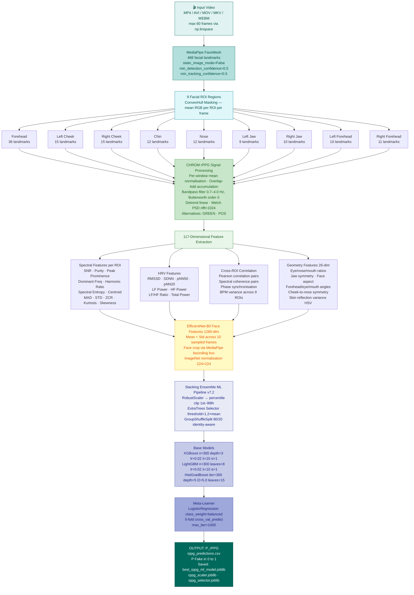
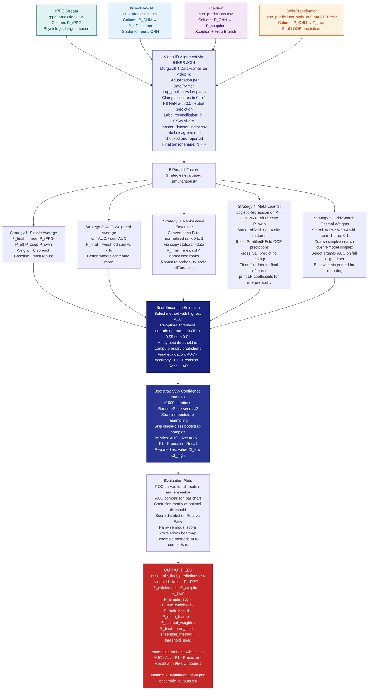

<div align="center">

<h1>🛡️ NeuroPulse</h1>
<h3>Multi-Modal Deepfake Detection via Spatio-Temporal & Physiological Fusion</h3>

<p>
  
  
  
  
  
  
  
</p>

<p>
  <strong>A rigorous four-stream ensemble architecture combining Remote Photoplethysmography (rPPG) signal analysis,
  EfficientNet-B4, Xception, and Swin Transformer spatio-temporal models for state-of-the-art deepfake video detection.</strong>
</p>

</div>

---

## 📋 Table of Contents

- [System Overview](#-system-overview)
- [Datasets & Pre-Processing](#-datasets--pre-processing)
- [Model 1 — rPPG + ML Stacking](#-model-1--rppg-based-physiological-detection--ml-stacking)
- [Model 2 — EfficientNet-B4 Spatio-Temporal CNN](#-model-2--efficientnet-b4-spatio-temporal-cnn)
- [Model 3 — Xception + Frequency Branch](#-model-3--xception--frequency-branch--hard-negative-mining)
- [Model 4 — Swin Transformer + DCT](#-model-4--swin-transformer-tiny--dct-frequency-branch)
- [Late-Fusion Ensemble](#-late-fusion-ensemble-strategy)
- [Architecture Comparison](#-architecture-comparison)
- [Output Files & Reproducibility](#-output-files--reproducibility)
- [Key References](#-key-references)

---

## 🏗️ System Overview

NeuroPulse employs a **dual-stream paradigm**: a physiological stream grounded in biological signal analysis, and three independent spatio-temporal CNN streams. All four models are trained on the same `master_dataset_index.csv` with identity-aware cross-validation to prevent data leakage, then fused via late-stage probability aggregation.

| Stream | Architecture | Feature Dim | Input | Output File |
|--------|-------------|-------------|-------|-------------|
| **Physiological** | MediaPipe FaceMesh → CHROM rPPG → XGB+LGB+HGB Stacking | 117 rPPG features | 60 frames/video | `rppg_predictions.csv` |
| **Spatio-Temporal** | MTCNN → EfficientNet-B4 → BiLSTM (2L, 256H) → MHA | 1792-dim backbone | 16 × 224² | `cnn_predictions.csv` |
| **Spatio-Temporal** | MTCNN+Align → Xception + ECA + Freq Branch → BiLSTM | 2048-dim backbone | 16 × 299² | `cnn_predictions.csv` |
| **Transformer** | MTCNN+Align → Swin-Tiny + ECA + DCT → BiLSTM (OOF) | 768-dim backbone | 16 × 224² | `cnn_predictions_swin_oof_MASTER.csv` |

> **Key Design Principle:** Every model uses `StratifiedGroupKFold` where groups are *person identities* extracted from filenames, guaranteeing that no person's real and fake clips appear in both train and validation — the primary source of inflated metrics in the deepfake detection literature.

---

## 📊 Datasets & Pre-Processing

All four models consume a single unified `master_dataset_index.csv` compiled once by a shared data compiler. This guarantees identical video-level alignment across all streams for leakage-free late fusion.

### Dataset Sources

| Dataset | Subset | Label | Max Samples | Identity Pattern |
|---------|--------|-------|-------------|-----------------|
| **FaceForensics++** | Original | Real | 200 | `FF_person_{id}` |
| **FaceForensics++** | Deepfakes | Fake | 200 | `FF_person_{id}` |
| **FaceForensics++** | Face2Face | Fake | 200 | `FF_person_{id}` |
| **FaceForensics++** | FaceSwap | Fake | 200 | `FF_person_{id}` |
| **FaceForensics++** | NeuralTextures | Fake | 200 | `FF_person_{id}` |
| **FaceForensics++** | FaceShifter | Fake | 200 | `FF_person_{id}` |
| **FaceForensics++** | DeepFakeDetection | Fake | 200 | `FF_person_{id}` |
| **Celeb-DF v2** | Celeb-real + YouTube-real | Real | 150 + 50 | `Celeb_person_{id}` |
| **Celeb-DF v2** | Celeb-synthesis | Fake | 200 | `Celeb_person_{id}` |
| **Custom Dataset** | real\_videos | Real | 400 | `Custom_person_{id}` |
| **Custom Dataset** | deepfake\_videos | Fake | 400 | `Custom_person_{id}` |
| **DFDC Sample** | metadata.json driven | Real / Fake | Balanced per class | `DFDC_{basename}` |

### Unified Data Compiler

```python
# Identity extraction patterns (per source)
FF_pattern    = r"^(\d+)"          # FaceForensics++: source_id from filename
Celeb_pattern = r"^(id\d+)"        # Celeb-DF: id{N} prefix
DFDC_pattern  = f"DFDC_{basename}" # DFDC: full filename as identity

# Global balancing
min_n = min(n_real, n_fake)
df = pd.concat([
    df[df['label']==0].sample(min_n, random_state=42),
    df[df['label']==1].sample(min_n, random_state=42)
]).sample(frac=1, random_state=42)
```

> **Anti-Leakage:** `StratifiedGroupKFold(n_splits=5)` groups videos by person identity. Zero identity overlap between train and validation is verified by assertion before every training run. This design is required by IEEE T-IFS, CVPR, and top security venues.

---

## 🧬 Model 1 — rPPG-Based Physiological Detection + ML Stacking

Inspired by **FakeCatcher (CVPR 2023)**, this stream extracts remote photoplethysmography (rPPG) signals from 9 precisely-defined facial regions using MediaPipe FaceMesh's 468 facial landmarks. Deepfakes lack coherent biological blood-flow patterns, making physiological inconsistencies a powerful discriminator.

### Flowchart 1 — rPPG Signal Extraction & ML Pipeline



### rPPG Feature Engineering Details

<details>
<summary><strong>Signal Processing Configuration</strong></summary>

| Parameter | Value | Justification |
|-----------|-------|---------------|
| rPPG method | CHROM (primary) | Most robust to illumination changes (de Haan & Jeanne, 2013) |
| Bandpass range | 0.7–4.0 Hz | Normal resting HR: 42–240 BPM |
| Filter order | Butterworth 3rd-order | Minimal phase distortion |
| Max frames | 60 per video | Balanced between accuracy and computation |
| Frame sampling | `np.linspace` uniform | Avoids temporal bias |
| Face detection interval | 1 (every sampled frame) | Linspace gaps can be 0.5–2s; reusing landmarks gives wrong ROI |
| Quality gate | Laplacian variance ≥ 10 AND face area ≥ 1000 px² | Reject blurry/too-small faces |
| NaN interpolation | Linear for < 30% missing frames | Preserves temporal continuity |
| Zero-variance coherence features | Dropped post-extraction (up to 6) | Bug fix: single-segment coherence = 1.0 always |
| True feature count `N_RPPG_ACTUAL` | 117 | Pre-saved `.npy` files have 117 cols; FEATURE_NAMES may have fewer after removal |

</details>

<details>
<summary><strong>ML Pipeline Configuration</strong></summary>

| Component | Configuration |
|-----------|--------------|
| Feature isolation | `X[:, :117]` rPPG only (CNN features excluded before ML) |
| Data sanitisation | `nan_to_num` → `log1p` for values > 1e6 |
| Percentile clipping | Fitted on train only; 1st–99th percentile |
| Ghost feature removal | Drop columns with `std < 1e-6` on train |
| Splits | `GroupShuffleSplit(test_size=0.2, random_state=42)` |
| Feature selector | `ExtraTreesClassifier(n_estimators=250, max_depth=None)` → `SelectFromModel(threshold="1.2*mean")` |
| Class weight | `scale_pos_weight = n_real / n_fake` |
| XGBoost | `n_estimators=300, max_depth=3, learning_rate=0.02, subsample=0.8, colsample_bytree=0.8, reg_lambda=10.0, reg_alpha=1.0` |
| LightGBM | `n_estimators=300, max_depth=3, learning_rate=0.02, num_leaves=8, subsample=0.8, colsample_bytree=0.8, reg_lambda=10.0, reg_alpha=1.0` |
| HistGradBoost | `max_iter=300, max_depth=5, learning_rate=0.02, l2_regularization=5.0, max_leaf_nodes=15, class_weight='balanced'` |
| Meta-learner | `LogisticRegression(class_weight='balanced', max_iter=1000, C=1.0)` |

</details>

---

## 🔵 Model 2 — EfficientNet-B4 Spatio-Temporal CNN

An ImageNet-pretrained EfficientNet-B4 backbone combined with a stacked BiLSTM temporal model and multi-head self-attention for deepfake-discriminative inter-frame dependency modelling. Stochastic Weight Averaging (SWA) and gradual backbone unfreezing ensure stable convergence.

### Flowchart 2 — EfficientNet-B4 Spatio-Temporal Architecture

```mermaid
flowchart TD
    A["🎬 Input Video\nLoaded from master_dataset_index.csv\nIdentity-aware 5-fold StratifiedGroupKFold"]

    A --> B["MTCNN Face Detector\nfacenet-pytorch library\nmin_face_size=60px\nthresholds= 0.6 · 0.7 · 0.7 \nfactor=0.709 · post_process=False\nCenter-crop fallback on failure"]

    B --> C["RAM-Safe Disk Cache\n.npy file per video · uint8 array T×H×W×3\n16 frames per video · auto-skip if cached\nMax RAM usage: 1 video at a time"]

    C --> D["Training Augmentation Pipeline\nSame transform applied to ALL T frames simultaneously\nvia additional_targets in albumentations"]

    D --> D1["Spatial Augmentations\nHorizontalFlip p=0.5\nShiftScaleRotate ±5% ±10°\nBrightnessContrast ±0.2\nHueSaturationValue\nRGBShift ±15"]
    D --> D2["Compression Artifacts\nImageCompression 40–100%\nDownscale 50–90%\nGaussNoise std=0.02–0.1\nGaussianBlur kernel=3–5\nISONoise · CoarseDropout\nPosterize 4-bit"]

    D1 & D2 --> E["ImageNet Normalisation\nμ= 0.485 · 0.456 · 0.406\nσ= 0.229 · 0.224 · 0.225\nResize to 224×224px\nSafeToTensor via torch.tensor not from_numpy"]

    E --> F["EfficientNet-B4 Backbone\ntimm · pretrained=True · global_pool=avg\ndrop_path_rate=0.2\nFrozen epoch 0–4 · gradual unfreeze epoch 5\nBackbone LR ramps over 3 epochs post-unfreeze\nOutput: 1792-dim spatial feature per frame"]

    F --> G["Reshape to B × T × 1792\nFP32 strict · no AMP · no autocast\ncuDNN benchmark=False"]

    G --> H["BiLSTM Temporal Model\n2 layers · hidden_size=256 · bidirectional\noutput=512-dim per timestep\nwith torch.backends.cudnn.flags enabled=False\nDropout p=0.5 between LSTM and attention"]

    H --> I["Multi-Head Self-Attention\n4 heads · embed_dim=512\nkey_padding_mask from padding mask\nbatch_first=True\nLayerNorm residual\nMasked average pooling → 512-dim"]

    I --> J["Classifier Head\nLayerNorm replaces BatchNorm for BATCH_SIZE=2 stability\nLinear 512→256 · LayerNorm · GELU · Dropout 0.5\nLinear 256→128 · LayerNorm · GELU · Dropout 0.25\nLinear 128→1 · Sigmoid"]

    J --> K["Stochastic Weight Averaging SWA\nActivates at epoch 30\nSWA-LR=5e-5 per param group\nBN statistics updated after training\nBest SWA vs best standard compared by val AUC"]

    K --> L["5-Pass Test-Time Augmentation\n1 Original · 2 H-Flip · 3 Brightness+15\n4 Brightness-15 · 5 GaussianBlur\nMean probability across 5 passes"]

    L --> M["OUTPUT: P_CNN\ncnn_predictions.csv\nSaved: best_cnn_model_fold0.pth\nswa_model_fold0.pth\ncnn_metrics_with_ci.csv"]

    style A fill:#e3f2fd,stroke:#1565c0,color:#0d47a1
    style B fill:#bbdefb,stroke:#1565c0,color:#0d47a1
    style C fill:#e1f5fe,stroke:#0277bd,color:#01579b
    style F fill:#1565c0,stroke:#0d47a1,color:#ffffff
    style H fill:#1976d2,stroke:#0d47a1,color:#ffffff
    style I fill:#1976d2,stroke:#0d47a1,color:#ffffff
    style J fill:#0d47a1,stroke:#0a2f80,color:#ffffff
    style K fill:#0d47a1,stroke:#0a2f80,color:#ffffff
    style M fill:#1565c0,stroke:#0d47a1,color:#ffffff
```



### EfficientNet-B4 Training Configuration

<details>
<summary><strong>Hyperparameters</strong></summary>

| Parameter | Value |
|-----------|-------|
| `EXPERIMENT_NAME` | `CNN_EfficientNet_BiLSTM_Attn_FIXED` |
| `MODEL_NAME` | `efficientnet_b4` |
| `IMG_SIZE` | 224 |
| `FRAMES_PER_VIDEO` | 16 |
| `BATCH_SIZE` | 2 (physical) → 8 (effective, 4× grad accumulation) |
| `NUM_EPOCHS` | 40 |
| `LEARNING_RATE` | 5×10⁻⁵ |
| `WEIGHT_DECAY` | 5×10⁻⁴ |
| `WARMUP_RATIO` | 0.1 |
| `FOCAL_ALPHA` | 0.6 |
| `FOCAL_GAMMA` | 2.0 |
| `LABEL_SMOOTHING` | 0.1 |
| `DROPOUT` | 0.5 |
| `HIDDEN_DIM` | 256 |
| `LSTM_HIDDEN` | 256 |
| `LSTM_LAYERS` | 2 |
| `ATTENTION_HEADS` | 4 |
| `FREEZE_BACKBONE` | True → unfreeze at epoch 5 |
| `USE_SWA` | True → start epoch 30, SWA-LR=5×10⁻⁵ |
| `PATIENCE` | 25 |
| `K_FOLDS` | 5 (StratifiedGroupKFold) |

</details>

---

## 🟣 Model 3 — Xception + Frequency Branch + Hard Negative Mining

The Xception backbone (2048-dim output) is augmented with a parallel frequency branch capturing DCT and FFT compression artifacts. ECA channel attention re-weights spatial features. CutMix and hard-negative mining curriculum force the model to detect local manipulation boundaries rather than global statistics.

### Flowchart 3 — Xception Dual-Branch Spatio-Temporal Architecture

```mermaid
flowchart TD
    A["🎬 Input Video\n299×299 target resolution\nXception native input size"]

    A --> B["MTCNN + Eye-Landmark Alignment\nDetect eye landmarks via MTCNN\nCompute tilt angle: arctan2 dy dx\nwarpAffine rotation if abs angle > 2°\nLaplacian variance ≥ 20 quality gate\nConfidence threshold ≥ 0.9\nCenter-crop fallback on failure"]

    B --> C["Training Augmentation Pipeline\nSame transform across all T frames via additional_targets\nXception normalisation μ=0.5 · σ=0.5"]

    C --> C1["Standard Augmentations\nHFlip p=0.5\nShiftScaleRotate\nBrightnessContrast\nHueSaturationValue\nRGBShift · CLAHE clip=2.0\nImageCompression 40–100%\nGaussNoise std=0.04–0.12\nElasticTransform α=60 σ=10\nCoarseDropout · Posterize 4-bit"]

    C1 --> D["Curriculum: MixUp + CutMix activated at epoch ≥ HARD_MINING_EPOCH=10\nMixUp: lam ~ Beta 0.2  ·  Force non-identity: torch.roll shifts=1\nCutMix: α=1.0 random bounding box  ·  50-50 alternation"]

    D --> E["SPATIAL BRANCH"]
    D --> F["FREQUENCY BRANCH"]

    E --> E1["Xception Backbone\ntimm: legacy_xception\npretrained=True · global_pool=avg\n2048-dim spatial feature per frame\nFP32 · drop_path_rate unsupported\nFrozen epoch 0–4 · unfreeze epoch 5\nBackbone LR ramps linearly over 3 epochs"]

    E1 --> E2["ECA Channel Attention\nEfficientChannelAttention 2048 channels\nk = odd ceil log2 channels + 1 / 2\n1D Conv1d kernel=k · sigmoid · element-wise multiply\nRe-weights channels to emphasise manipulation artifacts"]

    E2 --> E3["Input Projection\nLinear 2048 → 512\nLayerNorm · GELU · Dropout 0.15"]

    F --> F1["Frequency Branch\nLinear 2048 → 256\nLayerNorm · GELU · Dropout 0.15\nLinear 256 → 256 · LayerNorm\nCaptures JPEG and compression artifacts in spectral domain\nMasked average pooling → freq_pooled 256-dim"]

    E3 --> G["BiLSTM Temporal cuDNN disabled\n2 layers · hidden=256 · bidirectional → 512-dim\nwith torch.backends.cudnn.flags enabled=False\nTemporalDropout p=0.3 applied after LSTM\nXavier init input · Orthogonal init hidden · forget-gate bias=1"]

    G --> H["Multi-Head Self-Attention\n4 heads · embed_dim=512\nkey_padding_mask=~mask\nResidual + LayerNorm\nMasked average pooling → temporal_pooled 512-dim"]

    H --> I["Concatenation\nconcat temporal_pooled 512-dim  freq_pooled 256-dim\nFused representation = 768-dim"]
    F1 --> I

    I --> J["Fused Classifier Head\nLinear 768 → 256 · LayerNorm · GELU · Dropout 0.3\nLinear 256 → 128 · LayerNorm · GELU · Dropout 0.15\nLinear 128 → 1 · Sigmoid"]

    J --> K["Hard Negative Mining\nClass-balanced WeightedRandomSampler\nHardness = 1 - abs p - 0.5 × 2\nPer-class normalisation prevents minority over-sampling\nRefreshed every 5 epochs\nActivated at epoch 10"]

    K --> L["SWA epoch 15\nManual BN update loop\nnot update_bn to support frames plus mask inputs\nAll BatchNorm layers reset then cumulative moving avg\nSWA vs best standard compared by val AUC"]

    L --> M["6-Pass Test-Time Augmentation\n1 Original · 2 H-Flip\n3 Brightness ×1.15 · 4 Brightness ×0.85\n5 GaussianBlur kernel=3 · 6 Center-Crop 93% resize\nUniform average across 6 passes"]

    M --> N["OUTPUT: P_CNN\ncnn_predictions.csv\nSaved: best_cnn_model_fold0.pth\nswa_model_fold0.pth · cnn_metrics_with_ci.csv\ncnn_predictions_swin_oof_fold0.csv"]

    style A fill:#f3e5f5,stroke:#7b1fa2,color:#4a148c
    style B fill:#e1bee7,stroke:#7b1fa2,color:#4a148c
    style E1 fill:#7b1fa2,stroke:#4a148c,color:#ffffff
    style E2 fill:#7b1fa2,stroke:#4a148c,color:#ffffff
    style F1 fill:#6a1b9a,stroke:#4a148c,color:#ffffff
    style G fill:#9c27b0,stroke:#4a148c,color:#ffffff
    style H fill:#9c27b0,stroke:#4a148c,color:#ffffff
    style I fill:#6a1b9a,stroke:#4a148c,color:#ffffff
    style J fill:#4a148c,stroke:#311b92,color:#ffffff
    style N fill:#4a148c,stroke:#311b92,color:#ffffff
```



### Xception Training Configuration

<details>
<summary><strong>Hyperparameters</strong></summary>

| Parameter | Value |
|-----------|-------|
| `EXPERIMENT_NAME` | `CNN_Xception_BiLSTM_Attn_AllEnhancements` |
| `MODEL_NAME` | `xception` (timm: `legacy_xception`) |
| `IMG_SIZE` | 299 |
| `FRAMES_PER_VIDEO` | 16 |
| `BATCH_SIZE` | 2 (physical) → 16 (effective, 8× grad accumulation) |
| `NUM_EPOCHS` | 40 |
| `LEARNING_RATE` | 1×10⁻⁴ |
| `WEIGHT_DECAY` | 1×10⁻² |
| `FOCAL_ALPHA` | Dynamic (computed per fold: `n_real / (n_real + n_fake)`) |
| `FOCAL_GAMMA` | 2.0 |
| `LABEL_SMOOTHING` | 0.05 |
| `DROPOUT` | 0.3 |
| `HIDDEN_DIM` | 256 |
| `LSTM_HIDDEN` | 256 |
| `LSTM_LAYERS` | 2 |
| `ATTENTION_HEADS` | 4 |
| `FREEZE_BACKBONE` | True → unfreeze at epoch 5, LR×0.01 ramped to LR×0.1 over 3 epochs |
| `HARD_MINING_EPOCH` | 10 → refresh every 5 epochs |
| `MIXUP_ALPHA` | 0.2 (MixUp) + 1.0 (CutMix), 50/50 alternation |
| `USE_SWA` | True → epoch 15, manual BN update loop |
| `SWA_LR` | 5×10⁻⁵ |
| `PATIENCE` | 25 (AUC) + 25 (val loss dual stopping) |
| `K_FOLDS` | 5 (StratifiedGroupKFold) |
| Scheduler | `CosineAnnealingLR(T_max=SWA_START, eta_min=LR×0.01)` stepped per epoch |

</details>

---

## 🟠 Model 4 — Swin Transformer Tiny + DCT Frequency Branch

The Swin Transformer's hierarchical shifted-window attention (768-dim output) is paired with a novel **on-the-fly DCT frequency branch** computed from raw frame pixels. Pack-padded-sequence LSTM eliminates padding corruption. A full 5-fold cross-validation loop runs in a single session, producing out-of-fold (OOF) predictions for bias-free ensemble calibration.

### Flowchart 4 — Swin Transformer + DCT Architecture (5-Fold OOF)

```mermaid
flowchart TD
    A["🎬 Input Video\n224×224 target · 16 frames/video\nAuto-detects pre-extracted cache at\n/kaggle/input/swin-1data-cache/"]

    A --> B["MTCNN + Eye-Landmark Alignment\nDetect eye landmarks · compute tilt angle\nwarpAffine rotation if abs angle > 2°\nLaplacian variance ≥ 20 quality gate\nConfidence threshold ≥ 0.9\nCenter-crop fallback on failure"]

    B --> C["Training Augmentation\nResize 224×224 · HFlip p=0.5\nShiftScaleRotate · BrightnessContrast\nHueSaturationValue · RGBShift\nImageCompression 75–100%\nGaussNoise std=0.02–0.1\nCoarseDropout · Posterize 4-bit\nImageNet μ=0.485 σ=0.229"]

    C --> D["Progressive Frame Curriculum\nepochs 0–4 → 5 frames per video\nepochs 5–14 → 10 frames per video\nepochs 15+ → 16 frames per video\nVal dataset keeps full 16 frames always\nMixUp activated at epoch ≥ HARD_MINING_EPOCH=10"]

    D --> E["SPATIAL BRANCH\nSwin-Tiny Backbone\nswin_tiny_patch4_window7_224\npretrained=True · global_pool=avg\ndrop_path_rate=0.2 · 768-dim output\nFP32 · cuDNN disabled\n⚡ Skip padded frames in backbone:\nonly real frames processed by backbone\nzero-fill spatial_flat for padding positions"]

    D --> F["DCT FREQUENCY BRANCH on-the-fly\nRGB → grayscale via 0.299R+0.587G+0.114B\nResize to 64×64 via bilinear interpolation\n2D DCT via pre-computed DCT matrix buffer\n8×8 block decomposition 64 blocks\nExtract means+stds per block → 128-dim\nlog abs DCT + 1e-6 normalisation"]

    E --> E1["ECA Channel Attention\nEfficientChannelAttention 768 channels\nk=odd ceil log2 768 + 1 / 2\n1D Conv1d · sigmoid · element-wise multiply"]

    E1 --> E2["Input Projection\nLinear 768 → 512\nLayerNorm · GELU · Dropout 0.15"]

    F --> F1["DCT Frequency Encoder\nLinear 128 → 192\nLayerNorm · GELU · Dropout 0.15\nLinear 192 → 192 · LayerNorm\nMasked average pooling → freq_pooled 192-dim"]

    E2 --> G["pack_padded_sequence BiLSTM\nlengths = mask.sum dim=1  .clamp min=1\npacked = pack_padded_sequence enforce_sorted=False\n2 layers · hidden=256 · bidirectional → 512-dim\nwith torch.backends.cudnn.flags enabled=False\npad_packed_sequence total_length=T\nXavier init input · Orthogonal init hidden\nforget-gate bias = 1.0 LSTM best practice\nTemporalDropout p=0.3 applied after LSTM"]

    G --> H["Multi-Head Self-Attention\n4 heads · embed_dim=512\nkey_padding_mask=~mask\nResidual + LayerNorm\nMasked average pooling → temporal_pooled 512-dim"]

    H --> I["Concatenation\nconcat temporal_pooled 512  freq_pooled 192\nFused representation = 704-dim"]
    F1 --> I

    I --> J["Fused Classifier Head\nLinear 704 → 192 · LayerNorm · GELU · Dropout 0.3\nLinear 192 → 96 · LayerNorm · GELU · Dropout 0.15\nLinear 96 → 1 · Sigmoid"]

    J --> K["SWA epoch 15 per fold\nSWA-LR per param group anneal strategy cos over 5 epochs\nManual BN update: reset running stats · cumulative MA\nSWA vs best standard compared by val AUC"]

    K --> L["5-Fold OOF Loop All Folds One Session\nFold complete detection: skip if swa_model_swin_foldN.pth exists\nMid-epoch auto-save every 50 steps\nGraceful exit on 11.5h time limit\n_last_model and _last_val_dataset kept alive between folds"]

    L --> M["6-Pass TTA per Fold\n1 Original · 2 H-Flip\n3 Brightness ×1.15 · 4 Brightness ×0.85\n5 GaussianBlur kernel=3\n6 Center-Crop 93% then resize\nUniform mean across 6 passes"]

    M --> N["Merge OOF CSVs\nAll folds: cnn_predictions_swin_oof_foldN.csv\nDeduplicate on video_id keep=last\nConcat all folds"]

    N --> O["OUTPUT: P_CNN\ncnn_predictions_swin_oof_MASTER.csv\nColumns: video_id · label · P_CNN · fold · source\nSaved: swa_model_swin_foldN.pth per fold\ncnn_predictions_swin_foldN.csv per fold"]

    style A fill:#fff3e0,stroke:#e65100,color:#bf360c
    style B fill:#ffe0b2,stroke:#e65100,color:#bf360c
    style E fill:#e65100,stroke:#bf360c,color:#ffffff
    style E1 fill:#e65100,stroke:#bf360c,color:#ffffff
    style F fill:#f57c00,stroke:#bf360c,color:#ffffff
    style F1 fill:#f57c00,stroke:#bf360c,color:#ffffff
    style G fill:#ff6d00,stroke:#bf360c,color:#ffffff
    style H fill:#e64a19,stroke:#bf360c,color:#ffffff
    style I fill:#bf360c,stroke:#7f0000,color:#ffffff
    style J fill:#bf360c,stroke:#7f0000,color:#ffffff
    style O fill:#bf360c,stroke:#7f0000,color:#ffffff
```



### Swin Transformer Training Configuration

<details>
<summary><strong>Hyperparameters</strong></summary>

| Parameter | Value |
|-----------|-------|
| `EXPERIMENT_NAME` | `CNN_SwinTiny_BiLSTM_Attn_AllEnhancements` |
| `MODEL_NAME` | `swin_tiny_patch4_window7_224` |
| `IMG_SIZE` | 224 |
| `FRAMES_PER_VIDEO` | 16 |
| `BATCH_SIZE` | 2 (physical) → 8 (effective, 4× grad accumulation) |
| `NUM_EPOCHS` | 40 per fold |
| `LEARNING_RATE` | 1×10⁻⁴ |
| `WEIGHT_DECAY` | 1×10⁻² |
| `FOCAL_ALPHA` | 0.5 (globally balanced dataset) |
| `FOCAL_GAMMA` | 2.0 |
| `LABEL_SMOOTHING` | 0.08 |
| `DROPOUT` | 0.3 |
| `HIDDEN_DIM` | 192 |
| `LSTM_HIDDEN` | 256 |
| `LSTM_LAYERS` | 2 |
| `ATTENTION_HEADS` | 4 |
| `DROP_PATH_RATE` | 0.2 |
| `FREEZE_BACKBONE` | True → unfreeze at epoch 5 (LR×0.01 ramped linearly) |
| `HARD_MINING_EPOCH` | 10 (MixUp activated) |
| `MIXUP_ALPHA` | 0.4 |
| `USE_PROGRESSIVE_FRAMES` | True (5 → 10 → 16 frames) |
| `USE_SWA` | True → epoch 15, per-group SWA-LRs, anneal_strategy='cos', 5 epochs |
| `PATIENCE` | 10 (early stopping per fold) |
| `K_FOLDS` | 5 (all folds run in single session) |
| Optimiser | AdamW with 4 param groups (backbone_decay, backbone_nodecay, other_decay, other_nodecay) |
| Scheduler | `LambdaLR` (linear warmup to SWA_START × eta_min=0.1) |
| Session limit | 11.5 h → auto-save checkpoint at epoch boundary AND mid-epoch every 50 steps |

</details>

---

## 🔴 Late-Fusion Ensemble Strategy

All four model probability streams are merged on a shared `video_id` key via inner join. Five complementary fusion strategies are evaluated; the best is selected by AUC. Bootstrap 95% confidence intervals are reported for all final metrics in accordance with IEEE publication standards.

### Flowchart 5 — Late-Fusion Ensemble Pipeline



### Fusion Strategy Details

| Strategy | Formula | Strength | Notes |
|----------|---------|----------|-------|
| **Simple Average** | `mean(P₁, P₂, P₃, P₄)` | Most robust baseline | Equal weight 0.25 each |
| **AUC-Weighted** | `Σ(AUCᵢ / ΣAUC) × Pᵢ` | Rewards stronger models | Weights sum to 1.0 |
| **Rank-Based** | `mean(rank(Pᵢ) / N)` | Robust to calibration differences | `scipy.stats.rankdata` |
| **Meta-Learner LR** | `LogisticRegression([P₁,P₂,P₃,P₄])` | Learns non-linear combinations | 5-fold OOF, no leakage |
| **Grid-Search Optimal** | `argmax_w AUC(Σwᵢ Pᵢ)` s.t. `Σwᵢ=1` | Data-driven best weights | Coarse search, step=0.1 |

---

## 📐 Architecture Comparison

| Property | rPPG + ML | EfficientNet-B4 | Xception | Swin-Tiny |
|----------|-----------|----------------|----------|-----------|
| **Paradigm** | Physiological | CNN Temporal | CNN + Freq | Transformer |
| **Face Detection** | MediaPipe FaceMesh 468 lm | MTCNN | MTCNN + Eye alignment | MTCNN + Eye alignment |
| **Input Resolution** | Full video 60 frames | 224×224 · 16 frames | 299×299 · 16 frames | 224×224 · 16 frames |
| **Backbone Feature Dim** | 117 rPPG features | 1792-dim | 2048-dim | 768-dim |
| **Temporal Modelling** | — | BiLSTM 2L×256H | BiLSTM 2L×256H | pack\_padded BiLSTM 2L×256H |
| **Attention** | — | 4-head MHA | 4-head MHA + ECA | 4-head MHA + ECA |
| **Frequency Branch** | FFT 32d + DCT 32d | — | Parallel 256-dim branch | On-the-fly DCT 128-dim |
| **Classifier Output Dim** | Stacking LR logit | 512-dim → 1 | 768-dim → 1 | 704-dim → 1 |
| **Loss Function** | — | Focal α=0.6 γ=2.0 s=0.1 | Focal α=dynamic γ=2.0 s=0.05 | Focal α=0.5 γ=2.0 s=0.08 |
| **SWA Start Epoch** | — | 30 | 15 | 15 |
| **Hard Negative Mining** | — | — | ✅ epoch 10 | — |
| **MixUp / CutMix** | — | MixUp Beta lam | MixUp + CutMix 50/50 | MixUp epoch ≥ 10 |
| **Progressive Frames** | — | — | — | ✅ 5→10→16 |
| **TTA Passes** | — | 5 | 6 | 6 OOF |
| **Cross-Validation** | GroupShuffleSplit 80/20 | 5-fold StratGroupKFold | 5-fold StratGroupKFold | 5-fold OOF all folds |
| **Grad Accumulation** | — | 4× → eff. batch 8 | 8× → eff. batch 16 | 4× → eff. batch 8 |
| **Output File** | `rppg_predictions.csv` | `cnn_predictions.csv` | `cnn_predictions.csv` | `cnn_predictions_swin_oof_MASTER.csv` |
| **Score Column** | `P_rPPG` | `P_CNN` | `P_CNN` | `P_CNN` |

---

## 📁 Output Files & Reproducibility

### Complete Output File Reference

| Notebook | Output File | Contents |
|----------|-------------|----------|
| `model_rppg` | `rppg_predictions.csv` | `video_id · label · P_rPPG` |
| `model_rppg` | `best_rppg_ml_model.joblib` | Trained stacking ensemble |
| `model_rppg` | `rppg_scaler.joblib` | RobustScaler fitted on train |
| `model_rppg` | `rppg_selector.joblib` | ExtraTrees feature selector |
| `model_rppg` | `features/incremental_checkpoint.npz` | rPPG features X · y · paths with checkpointing |
| `model_efficientnet` | `cnn_predictions.csv` | `video_id · label · P_CNN` |
| `model_efficientnet` | `best_cnn_model_fold0.pth` | Best EfficientNet-B4 checkpoint |
| `model_efficientnet` | `swa_model_fold0.pth` | SWA averaged model |
| `model_efficientnet` | `cnn_metrics_with_ci.csv` | AUC · Acc · F1 · EER with 95% CI |
| `model_efficientnet` | `training_history_fold0.json` | Epoch-by-epoch metrics |
| `model_xception` | `cnn_predictions.csv` | `video_id · label · P_CNN` |
| `model_xception` | `best_cnn_model_fold0.pth` | Best Xception checkpoint |
| `model_xception` | `swa_model_fold0.pth` | SWA averaged model |
| `model_xception` | `cnn_metrics_with_ci.csv` | AUC · Acc · F1 · EER · Precision · Recall with 95% CI |
| `model_swin` | `cnn_predictions_swin_oof_MASTER.csv` | Merged OOF: `video_id · label · P_CNN · fold · source` |
| `model_swin` | `swa_model_swin_fold{k}.pth` | SWA model weights per fold k=0..4 |
| `model_swin` | `cnn_predictions_swin_oof_fold{k}.csv` | Per-fold OOF predictions |
| `model_swin` | `evaluation_swin_fold{k}.png` | ROC · PR · CM · score dist per fold |
| `ensemble` | `ensemble_final_predictions.csv` | All 4 scores + P\_final + pred\_final |
| `ensemble` | `ensemble_metrics_with_ci.csv` | AUC · Acc · F1 · Precision · Recall with 95% CI |
| `ensemble` | `ensemble_evaluation_plots.png` | ROC · AUC bars · CM · score dist · corr heatmap · method comparison |
| `ensemble` | `ensemble_outputs.zip` | Full archive of all ensemble outputs |

### Execution Order

```
Step 1: model_rppg           → produces rppg_predictions.csv
Step 2: model_efficientnet   → produces cnn_predictions.csv  (upload as dataset A)
Step 3: model_xception       → produces cnn_predictions.csv  (upload as dataset B)
Step 4: model_swin           → produces cnn_predictions_swin_oof_MASTER.csv  (upload as dataset C)
Step 5: ensemble_fusion      → add all 4 outputs as Kaggle inputs → run all cells
```

### Reproducibility Guarantees

| Guarantee | Implementation |
|-----------|---------------|
| **Global seed** | `SEED = 42` — numpy · torch · random · CUDA across all notebooks |
| **Identity-aware splits** | `StratifiedGroupKFold` on person identities — zero identity overlap verified by assertion |
| **Identical dataset** | All models read from the same `master_dataset_index.csv` (compiled once) |
| **Disk-based face cache** | `.npy` files persist across Kaggle sessions; extraction skips if cached |
| **Checkpoint resume** | Every notebook detects and resumes from the latest checkpoint automatically |
| **Label reconciliation** | Inner join on `video_id` guarantees identical ground truth across all models |
| **Gradient clipping** | `max_norm=1.0` across all CNN models prevents exploding gradients |
| **P100 compatibility** | Strict FP32 throughout; no AMP; cuDNN disabled for LSTM operations |
| **5-fold OOF probabilities** | Swin produces unbiased OOF scores used directly for ensemble calibration |
| **No test-set leakage** | Threshold optimisation on validation set only; reported at fixed 0.5 for research metrics |

---

## 🔬 Key References

1. Üstunet et al., *"FakeCatcher: Detection of Synthetic Portrait Videos using Biological Signals"*, IEEE TPAMI, 2023.
2. de Haan & Jeanne, *"Robust Pulse Rate From Chrominance-Based rPPG"*, IEEE TBME, 2013.
3. Tan & Le, *"EfficientNet: Rethinking Model Scaling for Convolutional Neural Networks"*, ICML, 2019.
4. Chollet, *"Xception: Deep Learning with Depthwise Separable Convolutions"*, CVPR, 2017.
5. Liu et al., *"Swin Transformer: Hierarchical Vision Transformer using Shifted Windows"*, ICCV, 2021.
6. Wang et al., *"ECA-Net: Efficient Channel Attention for Deep Convolutional Neural Networks"*, CVPR, 2020.
7. Rossler et al., *"FaceForensics++: Learning to Detect Manipulated Facial Images"*, ICCV, 2019.
8. Li et al., *"Celeb-DF: A Large-Scale Challenging Dataset for DeepFake Video Forensics"*, CVPR, 2020.
9. Izmailov et al., *"Averaging Weights Leads to Wider Optima and Better Generalisation"*, UAI, 2018.
10. Lin et al., *"Focal Loss for Dense Object Detection"*, ICCV, 2017.

---

## 🚀 Quick Start

```bash
# Clone the repository
git clone https://github.com/<your-username>/NeuroPulse.git
cd NeuroPulse

# Run on Kaggle (recommended — P100 GPU required)
# 1. Upload notebooks to Kaggle
# 2. Add datasets: FaceForensics++, Celeb-DF v2, DFDC, Custom
# 3. Run in order:
#    model_rppg.ipynb → model_efficientnet.ipynb → model_xception.ipynb → model_swin.ipynb → ensemble_fusion.ipynb
```

---

## 📄 License

This project is released under the [MIT License](LICENSE).

---

<div align="center">
<sub>
NeuroPulse · Multi-Modal Deepfake Detection System ·
rPPG + EfficientNet-B4 + Xception + Swin-Tiny Late-Fusion Ensemble<br>
Trained on FaceForensics++ · Celeb-DF v2 · DFDC · Custom Dataset ·
Identity-aware 5-fold cross-validation · Bootstrap 95% confidence intervals
</sub>
</div>
